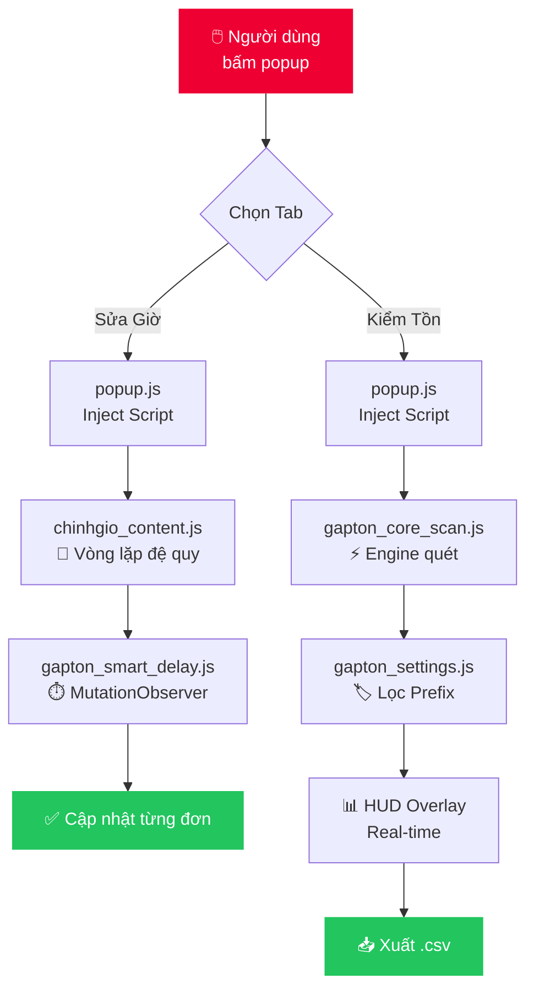

<div align="center">

<!-- HERO BANNER -->
<picture>
  
</picture>

<br/>

<!-- BADGES ROW 1 -->
<a href="#"></a>
&nbsp;
<a href="https://google.com/chrome"></a>
&nbsp;
<a href="LICENSE"></a>
&nbsp;
<a href="mailto:duongthaitan13@gmail.com"></a>

<br/><br/>

<!-- BADGES ROW 2 -->

&nbsp;

&nbsp;

&nbsp;


<br/><br/>

<!-- TAGLINE -->
> **🚀 Tự động hóa toàn trình · ⚡ Xử lý hàng trăm đơn · 📊 Xuất dữ liệu 1-click**
>
> *Tiết kiệm hàng giờ thao tác thủ công — không code, không cài đặt phức tạp.*

<br/>

<!-- QUICK LINKS -->
[📥 Cài đặt ngay](#-hướng-dẫn-cài-đặt) &ensp;·&ensp; [📖 Hướng dẫn sử dụng](#-cẩm-nang-sử-dụng) &ensp;·&ensp; [❓ FAQ](#-câu-hỏi-thường-gặp-faq) &ensp;·&ensp; [🐛 Báo lỗi](mailto:duongthaitan13@gmail.com) &ensp;·&ensp; [⭐ Đánh giá](#-tác-giả--hỗ-trợ)

</div>

---

## 📑 Mục lục

| # | Mục | Mô tả nhanh |
|---|-----|-------------|
| 1 | [🌟 Tính năng](#-tính-năng-đột-phá) | Hai module mạnh mẽ được tích hợp trong một giao diện |
| 2 | [🖼️ Demo](#-demo-hoạt-động) | Xem giao diện và luồng hoạt động thực tế |
| 3 | [🚀 Cài đặt](#-hướng-dẫn-cài-đặt) | Chỉ mất 30 giây, không cần biết code |
| 4 | [💡 Sử dụng](#-cẩm-nang-sử-dụng) | Hướng dẫn từng bước cho cả hai module |
| 5 | [❓ FAQ](#-câu-hỏi-thường-gặp-faq) | Giải đáp các lỗi và thắc mắc phổ biến |
| 6 | [📂 Kiến trúc](#-cấu-trúc-mã-nguồn) | Sơ đồ cấu trúc thư mục dự án |
| 7 | [👨‍💻 Tác giả](#-tác-giả--hỗ-trợ) | Thông tin liên hệ và hỗ trợ |

---

## 🌟 Tính năng đột phá

> Dự án hợp nhất **2 công cụ độc lập** vào một giao diện popup duy nhất — tinh tế, nhanh và không phụ thuộc vào bất kỳ thư viện ngoài nào.

<br/>

<table>
<tr>
<td width="50%" valign="top">

### 🕒 Module 1 · Auto Sửa Giờ
*Smart Delay Engine*

---

**✅ Tự động toàn trình**
Tìm kiếm mã đơn → Click **Sửa** → Chọn **Ngày** → **Cập nhật** — không cần can thiệp thủ công.

**📋 Xử lý Batch**
Dán hàng trăm mã vận đơn cùng lúc. Vòng lặp đệ quy tự động xử lý lần lượt từng mã.

**⚙️ Tuỳ biến Delay**
Cài `Độ trễ mạng` trực tiếp trên UI để chống lỗi khi server VTP phản hồi chậm.

**🔕 Zero Popup**
Hệ thống **Toast Notification** custom loại bỏ hoàn toàn các alert() gián đoạn.

</td>
<td width="50%" valign="top">

### 📦 Module 2 · Auto Kiểm Tồn
*Bypass UI Scanner*

---

**⚡ Quét siêu tốc**
Bỏ qua toàn bộ bước xác nhận rườm rà — nhập mã và kiểm tra trạng thái tức thì.

**📊 Bảng HUD Real-time**
Overlay nổi hiển thị % tiến trình, số mã **thành công / thất bại** trực tiếp trên màn hình.

**📁 Xuất Excel 1-click**
Export kết quả ra file `.csv` (UTF-8 BOM) ngay khi quét xong.

**🏷️ Bộ lọc thông minh**
Nhận diện tự động các đầu mã đặc biệt: `SHOPEE`, `TPO`, `PSL` — có thể mở rộng thêm.

</td>
</tr>
</table>

<br/>

> [!TIP]
> **Điểm khác biệt cốt lõi:** Toàn bộ hệ thống hoạt động hoàn toàn **phía client** — dữ liệu của bạn không đi qua bất kỳ server trung gian nào. An toàn tuyệt đối.

---

## 🖼️ Demo hoạt động

<div align="center">

<!-- Thay thế ảnh dưới đây bằng GIF demo thực tế của bạn -->


<br/><sub><i>💡 Giao diện popup chia tab và bảng tiến trình HUD real-time</i></sub>

</div>

<br/>

<details>
<summary><b>🖼️ Xem thêm ảnh chụp màn hình (Screenshots)</b></summary>

<br/>

<table>
<tr>
<td align="center" width="50%">

<br/><sub><b>Tab Sửa Giờ</b> — Dán mã, đặt delay, bấm chạy</sub>
</td>
<td align="center" width="50%">

<br/><sub><b>Tab Kiểm Tồn</b> — Bảng HUD và nút xuất Excel</sub>
</td>
</tr>
</table>

</details>

---

## 🚀 Hướng dẫn cài đặt

> [!NOTE]
> **Không cần biết lập trình.** Chỉ cần làm theo 4 bước dưới đây — toàn bộ quá trình mất khoảng **30 giây**.

<br/>

```
Bước 1 ──► Tải ZIP     Bước 2 ──► Mở Extensions    Bước 3 ──► Developer Mode    Bước 4 ──► Load Unpacked
    ↓               ↓                      ↓                         ↓
 GitHub           chrome://            Gạt ON                  Chọn thư mục
 Download        extensions/                                    đã giải nén ✅
```

<br/>

**Bước 1 — Tải source code**

Nhấn nút `<> Code` (màu xanh lá) → chọn `Download ZIP` → **giải nén** ra một thư mục bất kỳ.

**Bước 2 — Mở trang quản lý tiện ích**

Nhập trực tiếp vào thanh địa chỉ trình duyệt:

| Trình duyệt | Địa chỉ |
|:-----------:|:--------|
|  | `chrome://extensions/` |
|  | `edge://extensions/` |

**Bước 3 — Bật Developer Mode**

Gạt công tắc **`Chế độ dành cho nhà phát triển`** ở góc trên bên phải sang `ON`.

**Bước 4 — Nạp tiện ích**

Bấm **`Tải tiện ích đã giải nén`** (Load unpacked) → chọn thư mục đã giải nén ở Bước 1.

<br/>

> [!TIP]
> ✅ **Xong!** Bấm icon 📌 **ghim (pin)** tiện ích lên thanh công cụ để truy cập nhanh mọi lúc.

---

## 💡 Cẩm nang sử dụng

### 🕒 Tab Sửa Giờ — Hướng dẫn từng bước

```
[1] Mở popup   →   [2] Chọn tab "Sửa Giờ"   →   [3] Dán mã vận đơn
      ↓                                                     ↓
[4] Đặt Delay  ←────────────────────────────   [4] Mỗi mã một dòng
(mặc định: 5s)
      ↓
[5] Bấm ▶ BẮT ĐẦU CHẠY
      ↓
  Tool tự ẩn đi và xử lý tự động trên tab hiện tại 🤖
```

<br/>

> [!WARNING]
> **Lưu ý quan trọng:** Trong khi tool đang chạy, **không chuyển tab** hoặc đóng tab đang xử lý. Nếu mạng yếu, hãy tăng Delay lên **8–10 giây** để tránh sót đơn.

<br/>

### 📦 Tab Kiểm Tồn — Hướng dẫn từng bước

```
[1] Mở trang quản lý vận đơn Viettel Post
      ↓
[2] Bấm icon tiện ích → Chọn tab "Kiểm Tồn"
      ↓
[3] Bấm 🚀 CHẠY KIỂM TỒN
      ↓
[4] Bảng HUD xuất hiện ở góc dưới màn hình
    ┌─────────────────────────────┐
    │  ⏳ Tiến trình:  47 / 120   │
    │  ✅ Thành công:  45          │
    │  ❌ Thất bại:     2          │
    │  [████████░░░░]  39%        │
    │  [📥 Xuất Excel]            │
    └─────────────────────────────┘
      ↓
[5] Bấm "Xuất Excel" để tải file .csv khi hoàn tất
```

<br/>

> [!CAUTION]
> **⚠️ Quan trọng:** Tuyệt đối **không click chuột** hoặc **gõ phím** vào trang web khi Kiểm Tồn đang chạy. Việc này có thể làm mất focus và gián đoạn quá trình quét.

---

## ❓ Câu hỏi thường gặp (FAQ)

<details>
<summary><b>🔴 Tool báo lỗi "Vui lòng mở trang Viettel Post" dù tôi đang ở trang đó?</b></summary>

<br/>

Hãy kiểm tra lại URL trong thanh địa chỉ. Tool chỉ hoạt động trên các trang có domain:
- `viettelpost.vn`
- `viettelpost.com.vn`

**Giải pháp:** Nhấn `F5` để tải lại trang, sau đó mở lại tiện ích.

<br/>
</details>

<details>
<summary><b>🟡 Khi chạy Tab Sửa Giờ, tool bị sót đơn?</b></summary>

<br/>

**Nguyên nhân:** Server VTP phản hồi chậm hơn tốc độ thao tác của tool.

**Giải pháp:** Tăng ô **Độ trễ mạng** theo bảng sau:

| Tình trạng mạng | Delay đề nghị |
|:---------------:|:-------------:|
| Mạng tốt, ổn định | `5s` (mặc định) |
| Mạng trung bình | `8s` |
| Mạng yếu / VPN | `10s` trở lên |

<br/>
</details>

<details>
<summary><b>🟡 Xuất file Excel bị lỗi font tiếng Việt?</b></summary>

<br/>

File xuất ra đã được mã hóa chuẩn **UTF-8 BOM**. Nếu mở bằng Microsoft Excel trực tiếp bị lỗi chữ, hãy dùng một trong các cách sau:

| Cách | Hướng dẫn |
|------|-----------|
| ✅ Google Sheets | Upload file lên Google Drive → Mở bằng Google Sheets |
| ✅ Excel (Import) | `Data` → `From Text/CSV` → Chọn file → Encoding: `UTF-8` |
| ✅ LibreOffice Calc | Mở trực tiếp, chọn `UTF-8` khi được hỏi |

<br/>
</details>

<details>
<summary><b>🔵 Dữ liệu của tôi có được gửi lên server không?</b></summary>

<br/>

**Không.** Toàn bộ xử lý diễn ra **100% trên trình duyệt của bạn**. Extension không có server backend, không gửi bất kỳ dữ liệu nào ra ngoài. Bạn có thể tự kiểm tra trong tab `Network` của DevTools.

<br/>
</details>

---

## 📂 Cấu trúc mã nguồn

Kiến trúc thư mục **Clean Code** — phân tách rõ ràng theo chức năng, dễ bảo trì và nâng cấp:

```
📁 VTP_All_In_One/
│
├── 📄 manifest.json            ← [CORE]    Khai báo quyền & cấu hình Extension MV3
├── 📄 popup.html               ← [UI]      Giao diện popup 2 tabs (Sửa Giờ / Kiểm Tồn)
├── 📄 popup.js                 ← [LOGIC]   Điều hướng tab & inject content script
│
├── 📄 notification.js          ← [MODULE]  Hệ thống Toast Notification (thay thế alert)
│
├── 📄 chinhgio_content.js      ← [FEATURE] Vòng lặp đệ quy · Engine xử lý Sửa Giờ
│
├── 📄 gapton_settings.js       ← [CONFIG]  Quản lý Database Local · Cấu hình Prefix
├── 📄 gapton_smart_delay.js    ← [UTILS]   MutationObserver · Theo dõi thay đổi DOM
└── 📄 gapton_core_scan.js      ← [FEATURE] Engine quét mã · Render bảng HUD Overlay
```

<br/>



---

## 👨‍💻 Tác giả & Hỗ trợ

<div align="center">

<br/>


### Thái Tân Dương

*Full-stack Developer · Chrome Extension Specialist*

<br/>

[](https://github.com/duongthaitan)
&nbsp;&nbsp;
[](mailto:duongthaitan13@gmail.com)

<br/>

---

### Dự án có hữu ích với bạn?

Hãy để lại một ⭐ **Star** cho repository — chỉ mất 1 giây nhưng là động lực lớn để ra mắt thêm nhiều công cụ chất lượng! 🙏

<br/>

**Báo lỗi & góp ý:**
Mở [Issue](../../issues/new) trên GitHub hoặc gửi email trực tiếp đến tác giả.

<br/>

</div>

---

<div align="center">

<picture>
  
</picture>

<sub>

Made with ❤️ by [Thái Tân Dương](https://github.com/duongthaitan) &nbsp;·&nbsp; Licensed under [MIT](LICENSE) &nbsp;·&nbsp; © 2025

</sub>

</div>